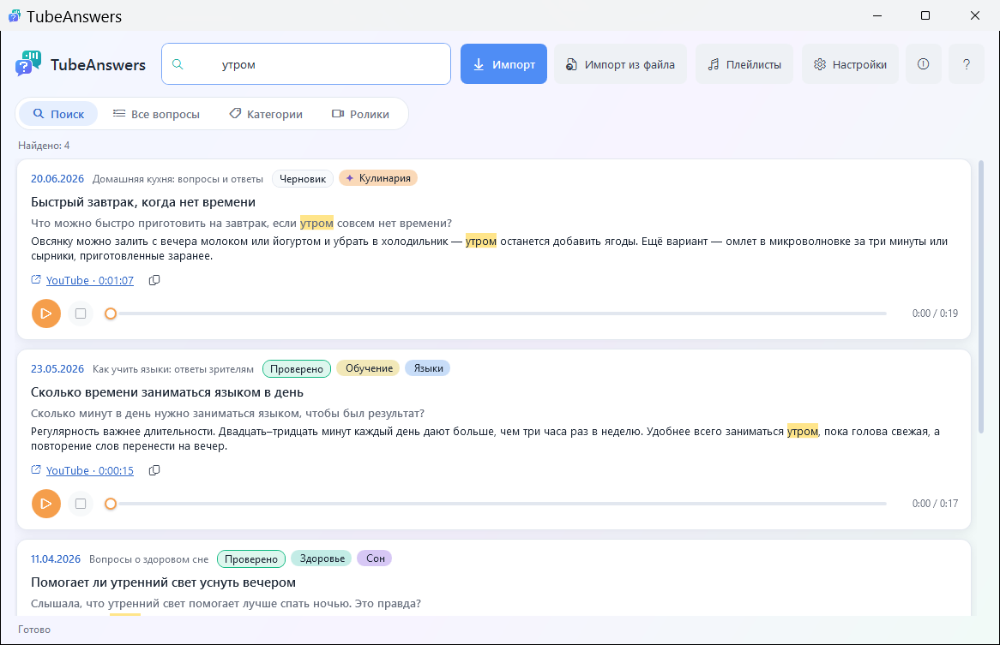
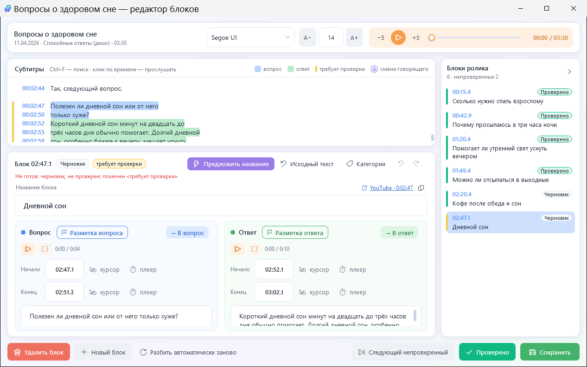
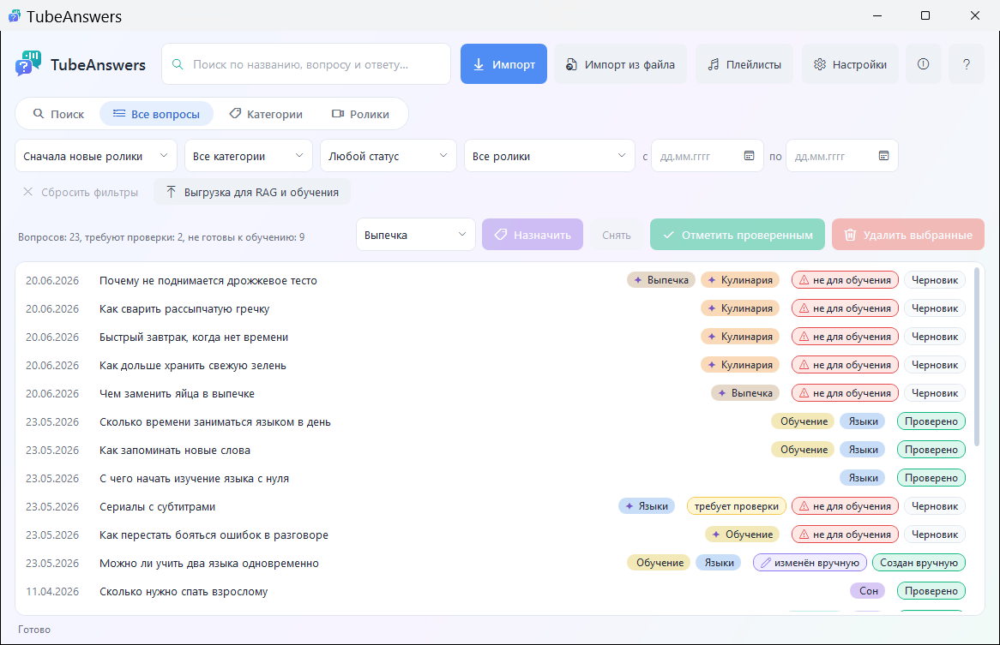
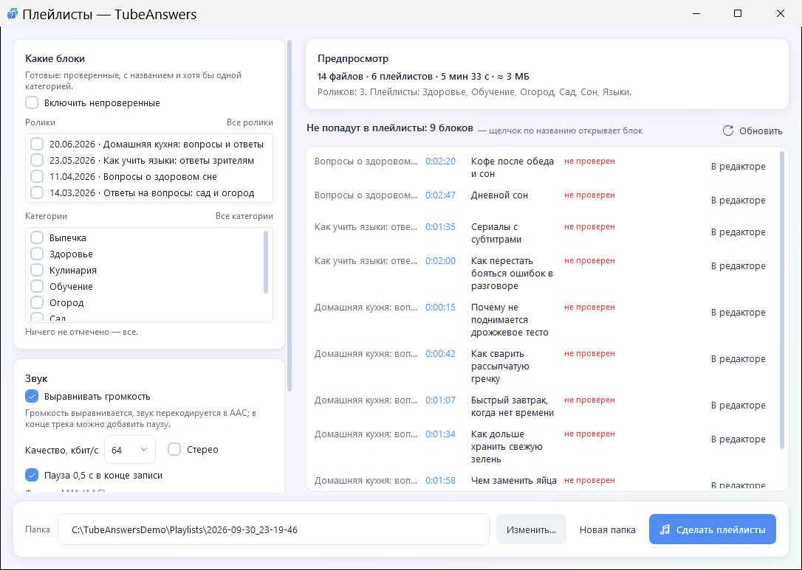

# TubeAnswers

Программа для Windows, которая превращает длинные видеобеседы с YouTube в формате «вопрос — ответ» в упорядоченную
базу знаний.

В таких выпусках ценные ответы рассеяны по многочасовым записям, и найти нужную мысль через месяц почти невозможно.
TubeAnswers сама находит в выпуске вопросы зрителей и ответы на них и делает из каждой пары отдельный блок: с названием,
датой выпуска, ссылкой на точный момент ролика и звуковым фрагментом, который играет прямо в программе.

**[Скачать последнюю версию](https://github.com/estread11-dot/TubeAnswers-Releases/releases/latest)** · [Лицензионное соглашение](LICENSE.md)

Здесь только установщики. Исходный код не публикуется.

## Что умеет

- распознаёт речь выпуска прямо на вашем компьютере (NVIDIA Parakeet, по желанию GigaAM);
- находит вопросы и ответы и делает из каждой пары блок; расставляет пунктуацию, придумывает названия;
- раскладывает блоки по темам-категориям;
- даёт проверить и поправить каждый блок: текст, границы вопроса и ответа, название — в редакторе со звуком;
- ищет по словам во всех выпусках сразу;
- собирает из блоков плейлисты по темам — для прослушивания на компьютере и телефоне с Android;
- выгружает проверенные блоки для систем поиска по знаниям (RAG) и для обучения языковых моделей.

Всё работает на вашем компьютере: программа не отправляет ваши данные ни автору, ни кому-либо ещё.

## Скриншоты

Снимки сделаны на демонстрационной базе: выпуски, канал и ссылки придуманы.

**Поиск по всем выпускам** — найденные слова подсвечены, звуковой фрагмент можно сразу прослушать:



**Редактор блоков** — текст выпуска с подсветкой вопросов и ответов, список блоков, границы вопроса и ответа:



**Все вопросы** — фильтры, категории и отметки о проверке:



**Плейлисты** — нарезка звука по темам для компьютера и телефона с Android:



Подробное руководство со скриншотами входит в программу: кнопка «Справка» или клавиша F1.

## Системные требования

| | |
|---|---|
| Система | Windows 10 или 11, 64-бит. Устанавливать .NET не нужно — всё входит в программу |
| Видеокарта | NVIDIA — для распознавания речи на компьютере (Parakeet берёт до ~4 ГБ видеопамяти). Без неё программа работает по субтитрам YouTube |
| Ollama | [ollama.com](https://ollama.com) — для поиска вопросов, пунктуации, названий и категорий. Рекомендуемая модель (Gemma 4 12B) занимает около 8 ГБ видеопамяти; без видеокарты Ollama работает, но медленнее. Вместо Ollama можно подключить OpenAI-совместимый сервис |
| Место на диске | ~250 МБ — программа и утилиты; модели распознавания и языковая модель — ещё несколько гигабайт |
| Интернет | для скачивания роликов, моделей и утилит (yt-dlp, ffmpeg) |

Модели распознавания речи, yt-dlp и ffmpeg программа предлагает скачать сама при первом запуске.

## Установка

1. Скачайте `TubeAnswers-Setup-<версия>.exe` из раздела [Releases](https://github.com/estread11-dot/TubeAnswers-Releases/releases/latest).
2. Запустите его. Если появится синее окно **«Система Windows защитила ваш компьютер»** — см. ниже.
3. Подтвердите запрос Windows о правах администратора (UAC). Программа ставится в `C:\Program Files\TubeAnswers`.
4. Прочитайте лицензионное соглашение до конца — после этого станет доступна кнопка «Принимаю».

Новая версия ставится поверх прежней: данные и настройки сохраняются. Данные программы хранятся в
`%LocalAppData%\TubeAnswers`; при удалении программы они остаются, если вы сами не отметите их удаление (тогда они
перемещаются в Корзину).

## Синее окно «Система Windows защитила ваш компьютер»

Это окно фильтра Microsoft Defender SmartScreen. Оно появляется для программ, у которых нет платной цифровой подписи
издателя и которые скачали ещё не очень много людей. TubeAnswers — небольшая бесплатная программа без такой подписи,
поэтому Windows и предупреждает. Само окно не означает, что в файле найден вирус.

Чтобы продолжить установку:

1. Нажмите **«Подробнее»**.
2. Проверьте имя файла: `TubeAnswers-Setup-<версия>.exe`, издатель — «Неизвестный издатель».
3. Нажмите **«Выполнить в любом случае»**.

Если сомневаетесь, сверьте контрольную сумму файла с той, что указана в описании релиза. В PowerShell:

```powershell
Get-FileHash "$env:USERPROFILE\Downloads\TubeAnswers-Setup-1.2.2.0.exe" -Algorithm SHA256
```

Строка `Hash` должна совпасть с SHA-256 из описания релиза. Скачивайте установщик только отсюда.

## Лицензия

TubeAnswers бесплатна для личного некоммерческого использования. Полный текст — в [LICENSE.md](LICENSE.md); он же
показывается при установке и в программе («О программе»).

Главное в пяти пунктах:

1. TubeAnswers бесплатна для личного некоммерческого использования.
2. Программа предоставляется «как есть», без каких-либо гарантий. Она создана системой искусственного интеллекта и может
   содержать ошибки — проверяйте результаты её работы.
3. За ролики, которые вы обрабатываете, отвечаете вы: соблюдайте права их авторов и правила YouTube.
4. Программа работает на вашем компьютере и не отправляет ваши данные ни автору программы, ни кому-либо ещё. В интернет
   она обращается только за роликами, моделями и инструментами, а к внешнему сервису искусственного интеллекта — только
   если вы сами его подключите.
5. Ваши данные хранятся у вас. Делайте резервные копии: автор программы не отвечает за их потерю.

## Кто создал

Программа разработана системой искусственного интеллекта Claude Opus 5.5 (компания Anthropic) с помощью инструмента
Claude Code по заказу, замыслу и под руководством Сергея Гончарова. Компания Anthropic не является стороной соглашения и
не распространяет программу.

Вопросы, сообщения об ошибках и предложения — в разделе [Issues](https://github.com/estread11-dot/TubeAnswers-Releases/issues).
